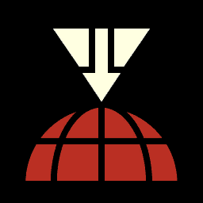

# 🛡️ Macro Helldivers 2 - v1.0.0

Uma ferramenta de alto desempenho, minimalista e segura para automatizar o acionamento de Estratagemas no Helldivers 2.



## 🚀 Funcionalidades

- **Zero Delay**: Sistema de cache de janela ativa para resposta instantânea, com velocidade do macro configurável (Padrão, Rápida ou Turbo).
- **Segurança Antidetecção**: Emulação de hardware via `nut.js`, com intervalos humanizados (variação aleatória entre teclas).
- **Inteligência de Janela**: O macro só funciona quando o Helldivers 2 é a janela em foco.
- **Overlay In-Game**: Interface sobreposta ao jogo (Ctrl + H) que nunca rouba o foco da missão.
- **Central de Builds**: Gerador de loadouts completos (estratagemas, armas, armadura, capacete, capa e booster) em dois modos: Meta, com estatísticas reais de pick rate da comunidade por facção e dificuldade, e Aleatória, com regras configuráveis (sets de armadura, loadout balanceado, máximo de 1 torreta).
- **Builds Salvas**: Salve loadouts completos com nome e aplique nos slots de macro com um clique, inclusive pelo overlay.
- **Arsenal Completo**: Banco de dados com todos os equipamentos do jogo (armas, armaduras, capacetes, capas, boosters e passivas), com ícones offline.
- **Busca de Estratagemas**: Filtro por nome na aba de macros, sem se preocupar com acentos.
- **Backup**: Exporte e restaure builds, slots e configurações em um arquivo JSON.
- **Sempre Ativo**: Roda silenciosamente na bandeja do sistema.
- **Personalização**: Escolha entre WASD ou Setas para os códigos.
- **Suporte a Sprint**: Funciona mesmo enquanto você corre (modificador configurável).

## 📥 Como Instalar e Usar

1. Baixe o instalador `.exe` na aba **[Releases](https://github.com/DionathaGoulart/Macro-Helldivers2/releases)**.
2. Execute o instalador e abra o app.
3. Configure seus 4 slots de estratagemas favoritos.
4. No jogo, certifique-se de que a tecla de abrir o menu de estratagemas é a mesma selecionada no app (Ctrl, Alt, = ou -).
5. **Recomendado**: Use as Setas do teclado no app para não interferir no seu movimento WASD.

---

## 🖥️ Overlay In-Game

O overlay (atalho **Ctrl+H**) é uma janela transparente que **nunca rouba o foco do jogo** — ele aparece por cima sem minimizar o Helldivers 2. Toda a interação no overlay é feita com o mouse (atribuir estratagemas, limpar slots, etc.).

- **Obrigatório**: use o jogo em **"Tela Cheia sem Borda"** (borderless). No modo "Tela Cheia", o Helldivers 2 **se auto-minimiza sempre que qualquer janela desenha por cima dele** (comportamento do DXGI fullscreen do jogo, verificado por teste — acontece até com janelas nativas do Windows, sem roubo de foco algum). A solução usada pelo Discord envolve injeção no processo do jogo — inviável aqui pelo risco com o anticheat GameGuard. O app detecta o modo "Tela Cheia" na config do jogo e exibe um aviso no overlay.
- **Limitação**: gravar atalhos de teclado pela aba Configurações **dentro do overlay** não funciona (o overlay não recebe teclado por design) — faça isso na janela principal do app.

---

## 🔄 Como funcionam as Atualizações Automáticas?

O app possui um sistema integrado de **Auto-Update**. 

### Como o app se atualiza:
1. Sempre que você abre o app, ele consulta o repositório no GitHub para ver se existe uma versão mais recente que a sua.
2. Se houver, ele baixa a atualização em segundo plano.
3. Na próxima vez que você abrir o app, ele instalará a nova versão automaticamente.

---

## 🛠️ Desenvolvimento e Compilação

Se você deseja modificar o código ou buildar manualmente:

### Pré-requisitos:
- Node.js v18+
- Modo de Desenvolvedor ativado no Windows (para links simbólicos).

### Comandos:
```bash
# Instalar dependências
npm install

# Rodar em modo desenvolvedor
npm run dev

# Gerar instalador .exe
npm run build

# Reconstruir o banco de equipamentos a partir da wiki da comunidade
npm run scrape

# Regenerar o mapeamento de estatísticas do helldive.live
npm run stats-map
```

---

## 🏗️ Estrutura do Projeto (Padrão Industrial)

```text
├── src/
│   ├── main/          # Processo Principal (Electron)
│   ├── renderer/      # Interface (React + Vite)
│   ├── macro/         # Motor de Execução (nut.js)
│   └── preload/       # Ponte de Segurança IPC
├── public/            # Assets estáticos e ícones
└── package.json       # Configurações de Build e Dependências
```

---
Criado por **DionathaGoulart**. Liberdade ou Morte! ⬆️➡️⬇️⬇️⬇️
