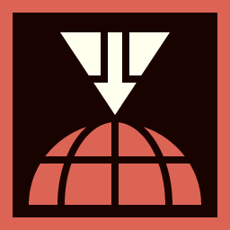

# 🛡️ Macro Helldivers 2 — v2.0.0

Ferramenta de macros para os Estratagemas do Helldivers 2. A v2 é uma reescrita
completa: **binário nativo em Rust sobre Win32 puro**, sem Electron, sem Chromium,
sem runtime de JavaScript. Um processo só, e nada rodando enquanto você não aperta
nada: a interface só repinta quando algo muda e a detecção de foco é por evento do
sistema, não por polling.



## 🚀 Funcionalidades

- **4 slots de macro** com atalho configurável (F1–F12, numpad, setas, letras…),
  em três perfis de velocidade (Padrão, Rápida e Turbo).
- **Estratagemas de apoio fixos**: Reforço, Ressuprimento e Rearmar Eagle em
  atalhos próprios, fora dos 4 slots.
- **Timing à prova de frame**: as teclas são enviadas por scancode via `SendInput`,
  com intervalos humanizados e um piso de tempo de tecla — o jogo lê o teclado uma
  vez por quadro, e uma tecla mais curta que isso simplesmente não existe pra ele.
- **Dispara enquanto você corre**: qualquer modificador seguro pode estar
  pressionado; correr e chamar um estratagema funciona.
- **Só com o jogo em foco**: a detecção é por evento do sistema, não por polling —
  alt-tab desarma os atalhos na hora e uma sequência em andamento é abortada,
  soltando todas as teclas.
- **Overlay in-game** (`Ctrl + H`): janela transparente que nunca rouba o foco,
  com strip de slots opcional sempre visível e um painel para atribuir
  estratagemas e aplicar builds salvas com o mouse.
- **Central de Builds** em três modos: **Meta**, com pick rates reais da comunidade
  (helldive.live) por facção e dificuldade; **Aleatória**, com regras (sets de
  armadura, loadout balanceado, máximo de 1 torreta) e cadeados por item; e
  **Personalizada**, montada na mão.
- **Builds salvas**: nomeie e aplique nos slots com um clique, inclusive pelo overlay.
- **Arsenal completo** offline: armas, armaduras, capacetes, capas, boosters e
  passivas, com ícones locais.
- **Busca sem acento** na grade de estratagemas.
- **Backup** de builds, slots e configurações em JSON — o mesmo formato da v1.
- **Bandeja do sistema**: minimizar ou fechar recolhe o app e os macros seguem ativos.
- **Idiomas**: português e inglês.

## 📥 Como Instalar e Usar

1. Baixe o instalador `.exe` na aba **[Releases](https://github.com/DionathaGoulart/Macro-Helldivers2/releases)**.
2. Execute o instalador e abra o app (ele pede elevação: o `SendInput` precisa do
   mesmo nível de integridade da janela que recebe as teclas).
3. Configure seus 4 slots de estratagemas favoritos.
4. No jogo, confira se a tecla que abre o menu de estratagemas é a mesma
   selecionada no app (Ctrl, Alt, `=` ou `-`).
5. **Recomendado**: use as Setas do teclado no app para não interferir no seu
   movimento WASD.

> O app fica na bandeja do sistema: minimizar ou fechar a janela **não encerra** os
> macros. Para sair de vez, use **Sair** no menu do ícone na bandeja.

### Vindo da v1

O instalador da v2 desinstala a v1 antes de instalar, e suas **configurações são
migradas automaticamente**. **Slots e builds salvas não migram sozinhos** — eles
viviam no armazenamento interno do Chromium, que não existe mais. O caminho:

1. Na v1, aba **Configurações → Backup → Exportar**.
2. Instale a v2 e importe o mesmo arquivo em **Configurações → Backup → Importar**.

## 🔄 Mudanças deliberadas em relação à v1

Não são regressões — são decisões da reescrita:

- **"Modificador de sprint" removido.** O hook de teclado da v2 dispara com qualquer
  modificador pressionado, então a opção não tinha mais o que resolver.
- **Animação de abertura removida.** O app abre direto na interface; boot instantâneo
  vale mais que a intro.
- **Painel do overlay enxuto**: só atribuição de slots e aplicação de builds salvas.
  Configurações e criação de builds ficam na janela principal — que é onde o teclado
  chega de verdade.

---

## 🖥️ Overlay In-Game

O overlay (atalho **Ctrl+H**) é uma janela transparente que **nunca rouba o foco do
jogo** — ele aparece por cima sem minimizar o Helldivers 2. Toda a interação nele é
feita com o mouse.

- **Obrigatório**: use o jogo em **"Tela Cheia sem Borda"** (borderless). No modo
  "Tela Cheia", o Helldivers 2 **se auto-minimiza sempre que qualquer janela desenha
  por cima dele** (comportamento do DXGI fullscreen do jogo, verificado por teste —
  acontece até com janelas nativas do Windows, sem roubo de foco algum). A solução
  usada pelo Discord envolve injeção no processo do jogo — inviável aqui pelo risco
  com o anticheat GameGuard. O app lê a configuração do jogo, detecta o modo "Tela
  Cheia" e exibe o aviso.
- **Limitação**: o overlay não recebe teclado por design (é o que garante que ele não
  roube o foco), então gravar atalhos é feito na janela principal.

---

## 🎯 Builds Personalizadas

Na aba **Builds → Personalizada** você monta o loadout na mão, sem depender de sorteio:

1. Clique no slot (1 a 4) que quer preencher.
2. Clique no estratagema na grade para equipar — clicar de novo no mesmo remove. A
   busca filtra por nome, sem acento.
3. Opcionalmente escolha primária, secundária, granada, armadura, capacete, capa e
   booster nas listas.
4. Dê um nome em **Builds Salvas** e clique em **Salvar**.

Atalhos úteis:

- **Usar slots atuais**: puxa os 4 estratagemas que já estão nos slots do macro.
- **Limpar tudo**: zera a build em edição.
- Clicar em uma build salva aplica os estratagemas direto nos slots de macro
  (funciona também pelo overlay).

As mesmas regras de exclusividade dos sorteios valem aqui: nada de estratagema
repetido nem dois exoesqueletos/veículos na mesma build.

---

## 🔄 Atualizações

O app consulta os Releases do GitHub e avisa quando há versão nova.

1. A checagem **nunca acontece com o jogo em foco** — ela fica adiada até você sair
   da partida.
2. O download só começa quando você clica em **Baixar**.
3. Com o instalador pronto, o app pergunta se quer reiniciar para instalar agora ou
   deixar para depois.

---

## 🛠️ Desenvolvimento e Compilação

O app **só roda no Windows**. Em macOS/Linux dá para compilar, checar e rodar os
testes dos módulos de lógica — todo código de janela, hook e input vive atrás de
`#[cfg(windows)]`. Detalhes em [CONTRIBUTING.md](CONTRIBUTING.md).

```bash
# toolchain (rust-toolchain.toml pina canal, componentes e alvo)
rustup target add x86_64-pc-windows-msvc

# build no Windows
cargo build --release --target x86_64-pc-windows-msvc

# cross-compilar do macOS/Linux, sem Visual Studio
cargo install cargo-xwin
cargo xwin build --release --target x86_64-pc-windows-msvc

# gates de qualidade
cargo fmt --all
cargo clippy --all-targets --target x86_64-pc-windows-msvc -- -D warnings
cargo test
```

O instalador é gerado pela CI a cada tag `vX.Y.Z` (NSIS, em `installer/installer.nsi`).

### Pipeline de dados (dev-only)

`assets/data/*.json` e `assets/icons/**` são gerados a partir da wiki da comunidade
por scripts Node. Eles não fazem parte do build do app:

```bash
cd scripts
npm install               # sharp + resvg (só aqui; o app não depende de Node)

npm run scrape            # equipment.json + imagens (--refresh ignora o cache)
npm run optimize-images   # PNG → WebP + reescrita das referências
npm run sync-stratagems   # stratagems.json + ícones
npm run stats-map         # statsMap.json (slugs do helldive.live)
```

> A ordem importa: `scrape` deixa `equipment.json` apontando para os `.png` que
> acabou de baixar, e é o `optimize-images` que os converte para WebP e reescreve
> as referências. Rodar um sem o outro deixa o repositório inconsistente.

> Depois de rodar `scrape` ou `sync-stratagems`, rode `stats-map` — ele valida se os
> nomes ainda casam com os slugs do helldive.live e avisa o que ficou sem par.

Nenhum binário externo é necessário: a rasterização de SVG e a conversão para WebP
saem do `sharp` e do `resvg`, instalados pelo `npm install`. O ImageMagick foi
removido do caminho de ícones porque o renderer SVG interno dele descarta elementos
com `transform="rotate(a x y) scale(...)"` — era o que fazia as Eagles Strafing Run
e Napalm Airstrike saírem sem a carga.

---

## 🏗️ Estrutura do Projeto

```text
├── src/
│   ├── engine.rs      # motor de macro: thread própria, SendInput por scancode
│   ├── hooks.rs       # WH_KEYBOARD_LL + SetWinEventHook (atalhos e foco)
│   ├── builds.rs      # geração de builds (lógica pura, testada no host)
│   ├── gfx/           # Direct2D, DirectWrite e decode de imagem
│   ├── ui/            # janela principal: toolkit de widgets e abas
│   └── overlay/       # strip e painel em janelas layered
├── assets/            # dados, ícones, fontes e o .ico do executável
├── installer/         # script NSIS
└── scripts/           # pipeline de dados da wiki (Node, dev-only)
```

---

Criado por **DionathaGoulart**. Liberdade ou Morte! ⬆️➡️⬇️⬇️⬇️
